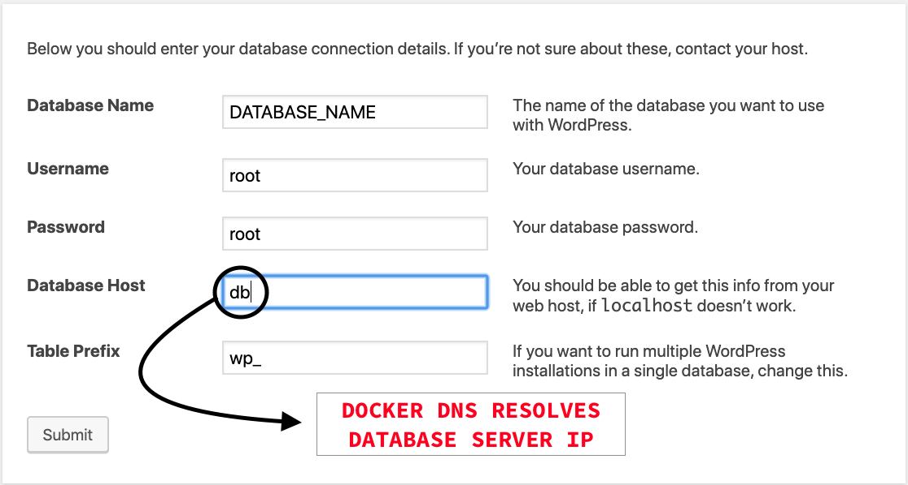

# Docker compose for development wordpress

A quick and easy way to start wordpress development in fully isolated docker containers.

## Images

wordpress, phpmyadmin/phpmyadmin and mysql (all images in latest version).

## Getting Started

1. Clone this repository

  ```console
    git clone https://github.com/whoamindx/wordpress-docker-compose.git my_project
  ```
2. Access your project path

  ```console
    cd my_project
  ```
3. Run docker-compose

  ```console
    docker-compose up -d
  ```

After this command you will notice that two folders have been created, ```database``` and ``` www```.

## How to use
### WordPress

In http://localhost:8080

### phpMyAdmin

In http://localhost:8081 (root password is ```root```)

### Persist data

Database data is alocated in ```./database``` path

WordPress files is alocated in ```./www``` path

# Attention ⚠️

The ip address of the mysql server is resolved internally by the docker through dns ```db```.


